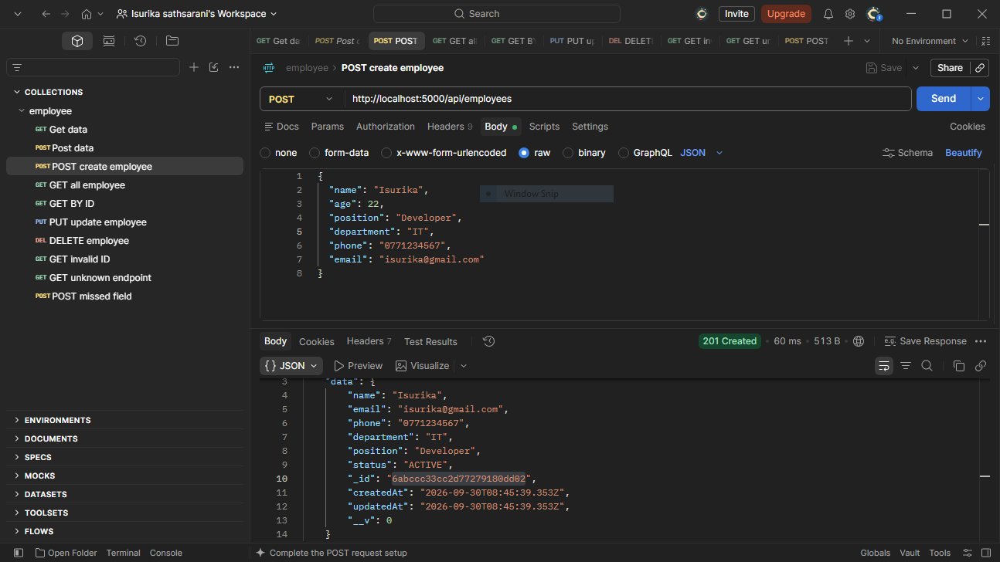
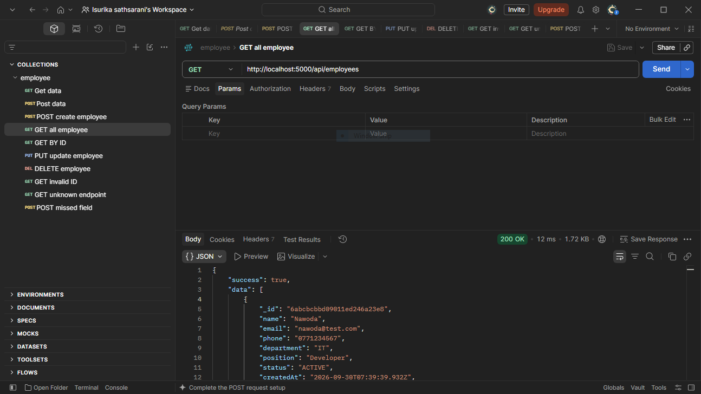
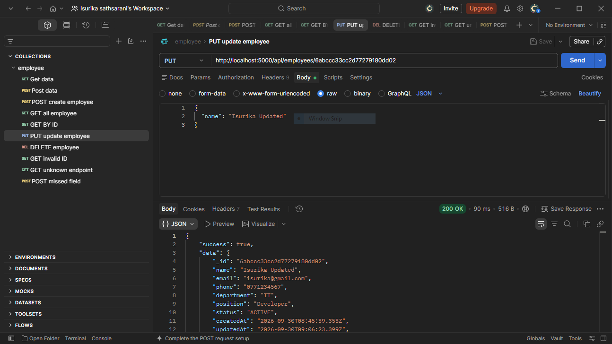
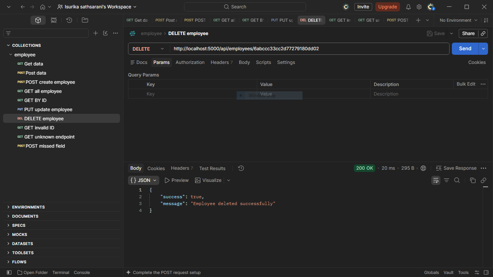
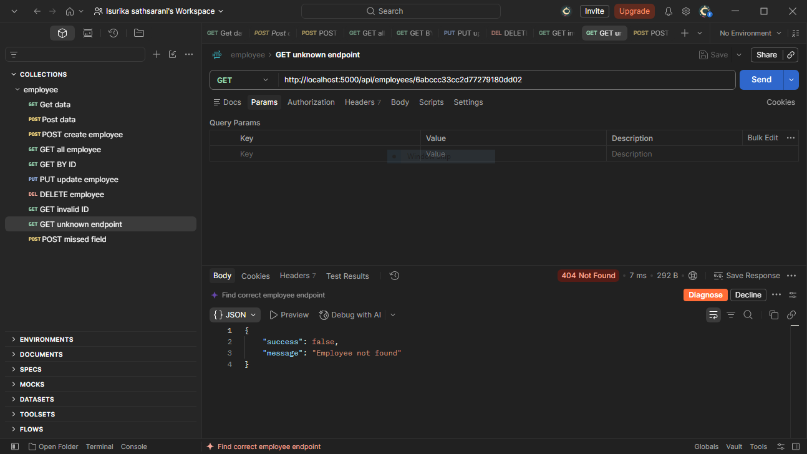
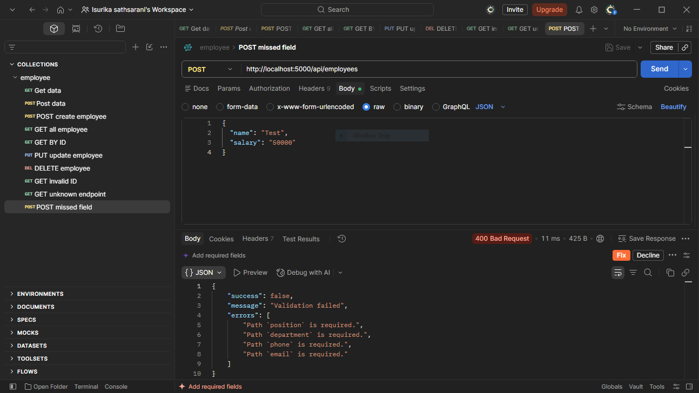

# Employee Management REST API

A REST API for managing employees, built with Node.js, Express.js, TypeScript and MongoDB (Mongoose).

## Features

- Create an employee
- Get all employees
- Get an employee by ID
- Update an employee
- Delete an employee
- Validation errors, duplicate emails and invalid IDs return proper 4xx responses

## Prerequisites

- Node.js 18+
- MongoDB running locally (or a MongoDB Atlas connection string)

## Installation

```bash
git clone https://github.com/NawodaWarnasooriya/employee-management-api.git
cd employee-management-api
npm install
```

Create a `.env` file (copy from `.env.example`):

```env
PORT=5000
MONGODB_URI=mongodb://127.0.0.1:27017/employee_management
```

## Running

```bash
# development (auto-reload)
npm run dev

# production
npm run build
npm start
```

The server starts at `http://localhost:5000`.

## Project Structure

```
src/
├── config/database.ts        # MongoDB connection
├── models/employee.model.ts  # Mongoose schema
├── services/                 # Database logic
├── controllers/              # Request/response handling
├── routes/                   # Route definitions
├── utils/handleError.ts      # Central error → status code mapping
├── app.ts                    # Express app
└── server.ts                 # Entry point
```

## Employee Model

| Field      | Type   | Rules                                   |
| ---------- | ------ | --------------------------------------- |
| name       | String | required                                |
| email      | String | required, unique, stored lowercase      |
| phone      | String | required                                |
| department | String | required                                |
| position   | String | required                                |
| status     | String | `ACTIVE` or `INACTIVE` (default ACTIVE) |

`createdAt` and `updatedAt` are added automatically.

## API Endpoints

Base URL: `/api/employees`

| Method | Endpoint | Description         |
| ------ | -------- | ------------------- |
| POST   | `/`      | Create an employee  |
| GET    | `/`      | Get all employees   |
| GET    | `/:id`   | Get employee by ID  |
| PUT    | `/:id`   | Update an employee  |
| DELETE | `/:id`   | Delete an employee  |

### Example: create an employee

`POST /api/employees`

```json
{
  "name": "Nimal Perera",
  "email": "nimal@example.com",
  "phone": "0771234567",
  "department": "Engineering",
  "position": "Backend Developer",
  "status": "ACTIVE"
}
```

Response `201 Created`:

```json
{
  "success": true,
  "data": {
    "_id": "...",
    "name": "Nimal Perera",
    "email": "nimal@example.com",
    "phone": "0771234567",
    "department": "Engineering",
    "position": "Backend Developer",
    "status": "ACTIVE"
  }
}
```

## Status Codes

| Code | Meaning                                      |
| ---- | -------------------------------------------- |
| 200  | Success                                      |
| 201  | Employee created                             |
| 400  | Validation failed or invalid employee ID     |
| 404  | Employee / route not found                   |
| 409  | Email already exists                         |
| 500  | Unexpected server error                      |


## API Testing Screenshots (Postman)

### 1. POST - Create Employee


### 2. GET - All Employees


### 3. GET By ID


### 4. PUT - Update Employee


### 5. DELETE - Delete Employee


### 6. GET Invalid ID - 400 Error


### 7. Unknown Endpoint - 404 Error


### 8. Missed Field - 400 Validation Error
